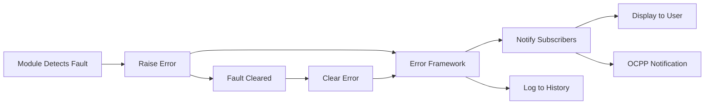

## Overview

EVerest Core provides a comprehensive error framework for reporting and handling error conditions. The framework supports:

- **Structured Errors**: Typed error definitions with severity levels
- **Error History**: Persistent error tracking and logging
- **Error Propagation**: Errors propagate through the module tree
- **Error Recovery**: Automatic and manual error clearing
- **MREC Compliance**: Minimum Required Error Codes for ChargeX consortium

## Error Framework Architecture

### Error Components

1. **Error Definitions**: YAML files defining error types
2. **Error Raising**: Modules raise errors via the error framework
3. **Error Subscribers**: Modules subscribe to error notifications
4. **Error History**: Central error logging and tracking
5. **Error Display**: User-facing error information

### Error Lifecycle



## Error Definition Files

**Location**: `errors/` directory

Error definitions are YAML files that specify error types:

```yaml
description: Error description
errors:
  - name: ErrorName
    description: Detailed error description
  - name: AnotherError
    description: Another error description
```

## Available Error Files

<AccordionGroup>
  <Accordion title="EVSE Manager Errors" icon="charging-station">
    **Source**: `errors/evse_manager.yaml`
    
    **Description**: Errors for EvseManager. Includes Minimum Required Error Codes (MREC) from ChargeX consortium.
    
    **Reference**: [ChargeX MREC Specification](https://inl.gov/content/uploads/2023/07/ChargeX_MREC_Rev5_09.12.23.pdf)

    ### Error List

    <ResponseField name="Internal" type="error">
      Internal error of the state machine
      
      **Severity**: Critical  
      **Recovery**: Automatic on state machine reset
    </ResponseField>

    <ResponseField name="MREC4OverCurrentFailure" type="error">
      Over current event detected
      
      **Severity**: Critical  
      **MREC**: Minimum Required Error Code #4  
      **Recovery**: Automatic when current returns to normal
    </ResponseField>

    <ResponseField name="MREC5OverVoltage" type="error">
      Over voltage event detected
      
      **Severity**: Critical  
      **MREC**: Minimum Required Error Code #5  
      **Recovery**: Automatic when voltage returns to normal
    </ResponseField>

    <ResponseField name="MREC9AuthorizationTimeout" type="error">
      No authorization was provided within timeout after plugin
      
      **Severity**: Warning  
      **MREC**: Minimum Required Error Code #9  
      **Recovery**: Automatic on new authorization attempt
    </ResponseField>

    <ResponseField name="PowermeterTransactionStartFailed" type="error">
      Transaction could not be started at the powermeter
      
      **Severity**: High  
      **Impact**: Cannot start signed metering  
      **Recovery**: Manual - check powermeter connection
    </ResponseField>

    <ResponseField name="Inoperative" type="error">
      Charging is not possible. Usually caused by another error from one of the requirements.
      
      **Severity**: Critical  
      **Recovery**: Automatic when underlying error is cleared
    </ResponseField>

    <ResponseField name="MREC22ResistanceFault" type="error">
      An Isolation Monitoring Device tripped due to low resistance to the chassis during active charging.
      
      **Severity**: Critical  
      **MREC**: Minimum Required Error Code #22  
      **Recovery**: Manual - safety inspection required
    </ResponseField>

    <ResponseField name="MREC11CableCheckFault" type="error">
      Cable check failed. Isolation monitor self test failed before charging.
      
      **Severity**: Critical  
      **MREC**: Minimum Required Error Code #11  
      **Recovery**: Automatic on next plug-in cycle
    </ResponseField>

    <ResponseField name="VoltagePlausibilityFault" type="error">
      Voltage plausibility check failed. Standard deviation between voltage measurements from different sources exceeded threshold for configured duration.
      
      **Severity**: High  
      **Recovery**: Automatic when measurements align
    </ResponseField>
  </Accordion>

  <Accordion title="Generic Errors" icon="triangle-exclamation">
    **Source**: `errors/generic.yaml`
    
    **Description**: Generic errors used by multiple modules

    <ResponseField name="CommunicationFault" type="error">
      Communication with the underlying hardware or device has a fault
      
      **Severity**: High  
      **Impact**: Module cannot communicate with hardware  
      **Recovery**: Automatic when communication restored
    </ResponseField>

    <ResponseField name="VendorError" type="error">
      Vendor specific error code
      
      **Severity**: Variable  
      **Usage**: Hardware-specific error conditions  
      **Recovery**: Depends on vendor implementation
    </ResponseField>

    <ResponseField name="VendorWarning" type="warning">
      Vendor specific warning code
      
      **Severity**: Low  
      **Usage**: Hardware-specific warning conditions  
      **Recovery**: Informational only
    </ResponseField>
  </Accordion>

  <Accordion title="Powermeter Errors" icon="gauge">
    **Source**: `errors/powermeter.yaml`
    
    **Description**: Power meter specific errors

    Common powermeter errors include:
    - Communication failures
    - Measurement out of range
    - Calibration errors
    - Signature verification failures
  </Accordion>

  <Accordion title="Board Support Errors" icon="microchip">
    **Source**: `errors/evse_board_support.yaml`
    
    **Description**: EVSE board support package errors

    Hardware-level errors from board support packages:
    - PWM generation failures
    - CP/PP signal errors  
    - RCD (Residual Current Device) trips
    - Relay failures
    - Ventilation errors
  </Accordion>

  <Accordion title="Connector Lock Errors" icon="lock">
    **Source**: `errors/connector_lock.yaml`
    
    **Description**: Connector locking mechanism errors

    Errors related to physical connector locking:
    - Lock motor failures
    - Position sensor errors
    - Lock timeout
    - Unlock failures
  </Accordion>

  <Accordion title="Isolation Monitor Errors" icon="shield">
    **Source**: `errors/isolation_monitor.yaml`
    
    **Description**: DC isolation monitoring errors

    Safety-critical isolation errors:
    - Self-test failures
    - Isolation resistance too low
    - Device malfunction
    - Communication errors
  </Accordion>

  <Accordion title="Power Supply Errors" icon="plug">
    **Source**: `errors/power_supply_DC.yaml`
    
    **Description**: DC power supply errors

    DC charging power supply errors:
    - Over temperature
    - Emergency shutdown
    - Voltage/current out of range
    - Communication timeout
  </Accordion>

  <Accordion title="System Errors" icon="server">
    **Source**: `errors/system.yaml`
    
    **Description**: System-level errors

    System operation errors:
    - Firmware update failures
    - Configuration errors
    - Storage failures
    - System resource exhaustion
  </Accordion>

  <Accordion title="Other Error Types" icon="ellipsis">
    Additional error definition files:

    - `errors/ac_rcd.yaml` - AC RCD errors
    - `errors/over_voltage_monitor.yaml` - Over-voltage protection
    - `errors/payment_terminal.yaml` - Payment terminal errors
    - `errors/example.yaml` - Example error definitions
  </Accordion>
</AccordionGroup>

## Error Severity Levels

Errors have implicit severity based on their impact:

| Severity | Impact | Example |
|----------|--------|----------|
| **Critical** | Charging must stop immediately | Over-current, isolation fault |
| **High** | Charging cannot start/continue | Powermeter failure, communication fault |
| **Medium** | Degraded operation | Single sensor failure with redundancy |
| **Low** | Warning only | Informational conditions |

## Error Interface

Modules interact with errors through the error framework:

### Raising Errors

```cpp
// In module implementation
raise_error("MREC4OverCurrentFailure");
```

### Clearing Errors

```cpp
// Error cleared automatically when condition resolves
clear_error("MREC4OverCurrentFailure");
```

### Subscribing to Errors

Modules can subscribe to error events:

```yaml
# In manifest.yaml
requires:
  evse:
    interface: evse_manager
```

```cpp
// Subscribe to error events
subscribe_error("evse", [](const Error& error) {
    // Handle error notification
    log_error(error);
});
```

## Error History Interface

**Interface**: `error_history`

The error history interface provides:

- **Error Logging**: Persistent storage of all errors
- **Error Retrieval**: Query historical errors
- **Error Statistics**: Error frequency and patterns
- **Error Filtering**: Filter by type, severity, time

### Using Error History

```yaml
# In configuration
error_history:
  module: ErrorHistory
  requires:
    error_sources:     # All modules that can raise errors
      - evse_manager
      - powermeter
      - board_support
```

## MREC Compliance

The ChargeX **Minimum Required Error Codes (MREC)** define standardized error codes for EV charging:

### Implemented MRECs

| MREC | Name | Description |
|------|------|-------------|
| MREC4 | OverCurrentFailure | Over-current protection triggered |
| MREC5 | OverVoltage | Over-voltage protection triggered |
| MREC9 | AuthorizationTimeout | Authorization not received in time |
| MREC11 | CableCheckFault | Pre-charge cable check failed |
| MREC22 | ResistanceFault | Isolation resistance fault during charging |

### MREC Benefits

- **Standardization**: Consistent error codes across vendors
- **Interoperability**: OCPP error code mapping
- **User Experience**: Clear, standardized error messages
- **Diagnostics**: Simplified troubleshooting

## Error Handling Best Practices

### For Module Developers

1. **Define Clear Errors**: Create descriptive error definitions
2. **Raise Early**: Detect and raise errors as soon as conditions are detected
3. **Clear Automatically**: Clear errors when conditions resolve
4. **Document Recovery**: Specify recovery procedures
5. **Test Error Paths**: Test error detection and recovery

### Error Definition Guidelines

```yaml
description: Clear description of error category
errors:
  - name: DescriptiveErrorName        # Use clear, descriptive names
    description: >-                   # Provide detailed description
      Detailed description of what causes this error,
      what the impact is, and how to recover.
```

### Error Naming Conventions

- Use PascalCase for error names
- Include MREC prefix for standardized codes
- Be specific about the fault condition
- Examples: `MREC4OverCurrentFailure`, `PowermeterTransactionStartFailed`

## OCPP Error Integration

Errors integrate with OCPP for remote monitoring:

### Error to OCPP Mapping

| EVerest Error | OCPP Error Code |
|---------------|----------------|
| MREC4OverCurrentFailure | OverCurrentFailure |
| MREC5OverVoltage | OverVoltage |
| MREC22ResistanceFault | GroundFailure |
| CommunicationFault | OtherError |

### StatusNotification

Errors trigger OCPP StatusNotification messages:

```json
{
  "status": "Faulted",
  "errorCode": "OverCurrentFailure",
  "info": "MREC4: Over current detected on phase L1",
  "timestamp": "2026-03-04T12:34:56Z"
}
```

## Error Display

Errors can be displayed to users via:

### Display Message Interface

Use `display_message` interface for user notifications:

```cpp
display_message({
    .message = "Charging stopped: Over current detected",
    .priority = MessagePriority::AlwaysFront,
    .state = MessageState::Faulted
});
```

### LED Indicators

Hardware BSP modules can map errors to LED patterns:

- **Red solid**: Critical error (over-current, isolation fault)
- **Red blinking**: High severity error (communication fault)
- **Yellow**: Medium severity warning

## Debugging Errors

### Error Logging

Enable debug logging for error framework:

```yaml
# In config
logging:
  error_framework: debug
```

### Error History Query

Query error history for diagnostics:

```cpp
// Get last 100 errors
auto errors = error_history.get_errors(100);

for (const auto& error : errors) {
    std::cout << error.timestamp << ": " 
              << error.type << " - " 
              << error.message << std::endl;
}
```

### Common Error Scenarios

<Accordion title="Authorization Timeout">
  **Error**: `MREC9AuthorizationTimeout`
  
  **Cause**: EV plugged in but no authorization received within timeout
  
  **Resolution**:
  - Check auth token provider (RFID reader, autocharge)
  - Verify connection timeout configuration
  - Check authorization backend connectivity
</Accordion>

<Accordion title="Powermeter Communication">
  **Error**: `CommunicationFault` (from powermeter)
  
  **Cause**: Cannot communicate with power meter
  
  **Resolution**:
  - Check serial/Modbus connection
  - Verify baud rate and settings
  - Check cable connections
  - Verify power meter is powered on
</Accordion>

<Accordion title="Isolation Fault">
  **Error**: `MREC22ResistanceFault`
  
  **Cause**: DC isolation resistance too low
  
  **Resolution**:
  - **CRITICAL SAFETY ISSUE**
  - Stop charging immediately (automatic)
  - Inspect vehicle and cable for damage
  - Check isolation monitor device
  - May require professional inspection
</Accordion>

## Next Steps

- Review [Interface Reference](/api-reference/interfaces) for error-related interfaces
- Explore [Module Development](/development/creating-modules) to implement error handling
- Check [EVSE Manager](/api-reference/interfaces#evse_manager) for session error flows
- Study source error YAML files in `errors/` directory