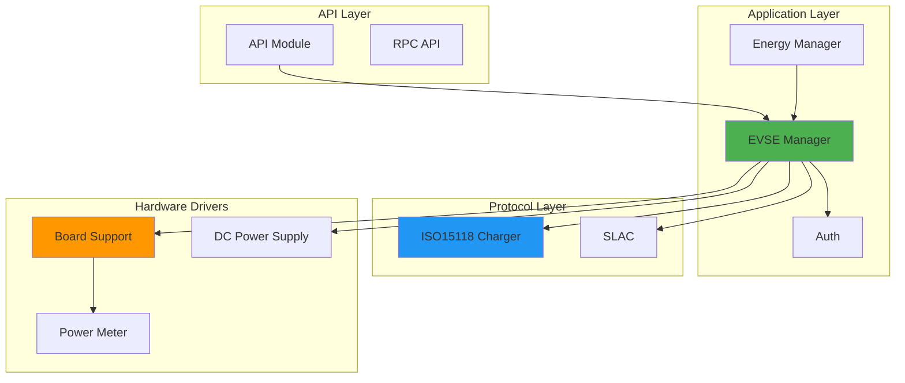

## Overview

EVerest is a modular framework for setting up a full stack environment for EV charging. The architecture is designed around flexibility, extensibility, and standards compliance, making it suitable for both AC and DC charging applications.

## Modular Design Philosophy

EVerest's core strength lies in its **modular architecture**. Instead of a monolithic application, EVerest is composed of independent, interchangeable modules that communicate through well-defined interfaces.

### Key Principles

<CardGroup cols={2}>
  <Card title="Separation of Concerns" icon="layer-group">
    Each module handles a specific aspect of the charging process (hardware control, protocol handling, energy management, etc.)
  </Card>
  <Card title="Reusability" icon="recycle">
    Modules can be reused across different charging station configurations and hardware platforms
  </Card>
  <Card title="Flexibility" icon="arrows-split-up-and-left">
    Mix and match modules to build custom charging solutions tailored to your needs
  </Card>
  <Card title="Testability" icon="flask">
    Modules can be tested in isolation or replaced with simulators for development
  </Card>
</CardGroup>

## Message-Based Architecture

All communication between modules happens through **MQTT (Message Queuing Telemetry Transport)**, a lightweight publish-subscribe messaging protocol.

### Why MQTT?

- **Decoupling**: Modules don't need to know about each other's implementation details
- **Scalability**: Easy to add new modules without modifying existing ones
- **Debugging**: All inter-module communication can be monitored and logged
- **Flexibility**: Supports both local and remote module deployment

### Communication Patterns

EVerest uses three primary MQTT communication patterns:

1. **Commands** - Synchronous request-response calls between modules
2. **Variables** - Asynchronous publication of state changes and telemetry
3. **Errors** - Error reporting and handling across the system

<Tip>
  Learn more about the messaging patterns in the [Messaging](/core-concepts/messaging) section.
</Tip>

## Framework Components

The EVerest framework provides the runtime environment and core services for modules:

### Runtime Environment

Located in `lib/everest/framework/`, the framework provides:

```cpp
// Core runtime (lib/everest/framework/include/framework/runtime.hpp)
namespace Everest {
  // Environment variables for configuration
  inline constexpr auto EV_MODULE = "EV_MODULE";
  inline constexpr auto EV_PREFIX = "EV_PREFIX";
  inline constexpr auto EV_MQTT_EVEREST_PREFIX = "EV_MQTT_EVEREST_PREFIX";
  inline constexpr auto EV_MQTT_BROKER_HOST = "EV_MQTT_BROKER_HOST";
  inline constexpr auto EV_MQTT_BROKER_PORT = "EV_MQTT_BROKER_PORT";
}
```

### MQTT Abstraction Layer

The framework provides a C++ abstraction for MQTT operations:

```cpp
// lib/everest/framework/include/utils/mqtt_abstraction.hpp
class MQTTAbstraction {
public:
    // Connect to MQTT broker
    bool connect();
    
    // Publish JSON data to a topic
    void publish(const std::string& topic, const nlohmann::json& json);
    
    // Subscribe to topics
    void subscribe(const std::string& topic, QOS qos);
    
    // Get data from a topic
    nlohmann::json get(const std::string& topic, QOS qos);
};
```

### Module Lifecycle

The framework manages the complete lifecycle of modules:

1. **Initialization** - Load configuration and establish MQTT connection
2. **Connection** - Wire up module dependencies based on configuration
3. **Ready** - Signal that the module is ready to operate
4. **Running** - Process commands and publish variables
5. **Shutdown** - Clean up resources and disconnect

## System Diagram

Here's how a typical DC charging station is structured in EVerest:



### Layer Breakdown

<AccordionGroup>
  <Accordion title="API Layer">
    Provides external interfaces (REST API, WebSocket, MQTT) for integration with management systems, mobile apps, and OCPP backends.
  </Accordion>
  
  <Accordion title="Application Layer">
    Contains the core business logic:
    - **EVSE Manager**: Orchestrates the charging session
    - **Auth**: Handles authorization (RFID, Plug & Charge)
    - **Energy Manager**: Manages power distribution across multiple charging points
  </Accordion>
  
  <Accordion title="Protocol Layer">
    Implements charging protocols:
    - **ISO15118**: High-Level Communication (HLC) for AC/DC charging
    - **SLAC**: Signal Level Attenuation Characterization for PLC
    - **OCPP**: Open Charge Point Protocol for backend communication
  </Accordion>
  
  <Accordion title="Hardware Drivers">
    Low-level drivers for hardware components:
    - Board support packages (BSP)
    - DC/AC power supplies
    - Power meters
    - RCD (Residual Current Device)
    - Connector locks
  </Accordion>
</AccordionGroup>

## Configuration-Driven Assembly

EVerest uses YAML configuration files to assemble modules into a complete charging station. The configuration defines:

- Which modules to instantiate
- How modules are connected (which interfaces they provide/require)
- Module-specific configuration parameters

Example configuration structure:

```yaml
active_modules:
  evse_manager:
    module: EvseManager
    config_module:
      connector_id: 1
      charge_mode: DC
    connections:
      bsp:
        - module_id: yeti_driver
          implementation_id: board_support
      hlc:
        - module_id: iso15118_charger
          implementation_id: charger
```

<Tip>
  See the [Configuration](/core-concepts/configuration) section for detailed configuration examples.
</Tip>

## Multi-Language Support

EVerest modules can be written in multiple programming languages:

- **C++** - Primary language for performance-critical modules (located in `lib/everest/framework/`)
- **Python** - For rapid development and testing (`lib/everest/framework/everestpy/`)
- **JavaScript** - Browser-based tools and UIs (`lib/everest/framework/everestjs/`)
- **Rust** - Emerging support for safety-critical components (`lib/everest/framework/everestrs/`)

## Benefits of This Architecture

<CardGroup cols={2}>
  <Card title="Hardware Independence" icon="microchip">
    Swap hardware drivers without changing application logic
  </Card>
  <Card title="Protocol Flexibility" icon="network-wired">
    Support multiple charging protocols (ISO15118, OCPP, etc.) simultaneously
  </Card>
  <Card title="Incremental Development" icon="code-branch">
    Develop and test individual modules in isolation
  </Card>
  <Card title="Standards Compliance" icon="shield-check">
    Easy to maintain compliance with evolving standards by updating specific modules
  </Card>
</CardGroup>

## Next Steps

<CardGroup cols={2}>
  <Card title="Modules" href="/core-concepts/modules" icon="cube">
    Learn about the module system and available modules
  </Card>
  <Card title="Interfaces" href="/core-concepts/interfaces" icon="plug">
    Understand how modules communicate through interfaces
  </Card>
  <Card title="Configuration" href="/core-concepts/configuration" icon="sliders">
    Configure your charging station
  </Card>
  <Card title="Messaging" href="/core-concepts/messaging" icon="message">
    Deep dive into MQTT-based messaging
  </Card>
</CardGroup>
