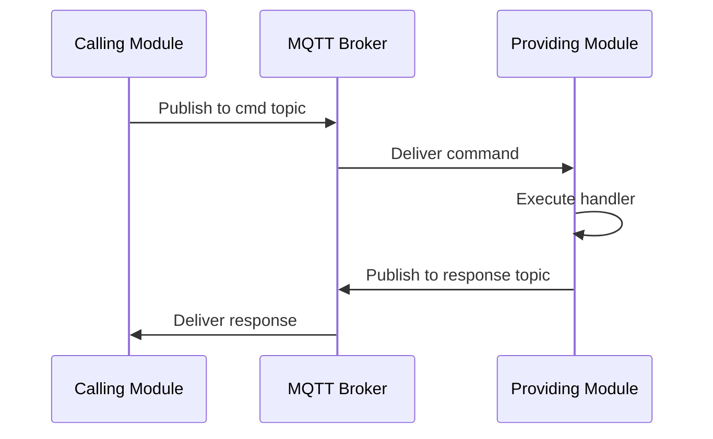
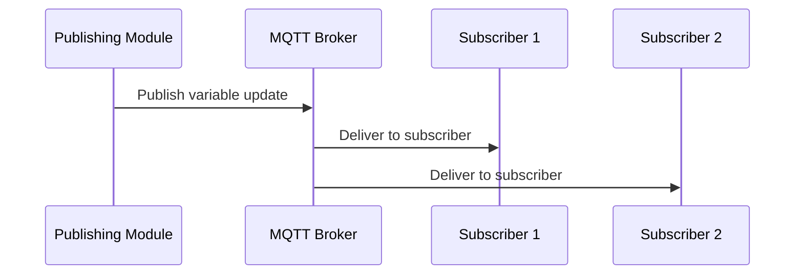
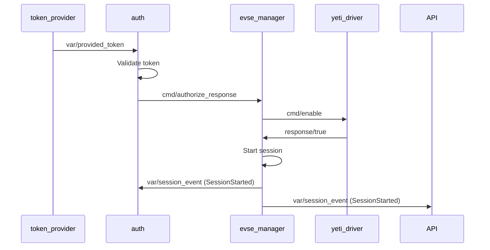

## Overview

EVerest uses **MQTT (Message Queuing Telemetry Transport)** as its message bus for all inter-module communication. This lightweight publish-subscribe protocol provides loose coupling, reliability, and easy debugging.

<Info>
  All module communication - commands, variables, and errors - flows through MQTT topics. This makes the entire system observable and debuggable.
</Info>

## Why MQTT?

MQTT was chosen for several key reasons:

<CardGroup cols={2}>
  <Card title="Decoupling" icon="link-slash">
    Modules don't need direct references to each other
  </Card>
  <Card title="Observability" icon="eye">
    All communication can be monitored in real-time
  </Card>
  <Card title="Persistence" icon="database">
    Messages can be retained for state recovery
  </Card>
  <Card title="QoS Levels" icon="shield-check">
    Configurable delivery guarantees (at most once, at least once, exactly once)
  </Card>
</CardGroup>

## MQTT Broker Setup

EVerest requires an MQTT broker. The most common choice is **Mosquitto**:

### Local Broker (Default)

```bash
# Install Mosquitto
sudo apt-get install mosquitto

# Start broker
sudo systemctl start mosquitto

# EVerest will connect to localhost:1883 by default
```

### Unix Socket Connection

For better performance on local systems:

```bash
# Configure Mosquitto to listen on Unix socket
# /etc/mosquitto/mosquitto.conf
listener 1883 localhost
listener 0 /tmp/mqtt.sock

# Connect EVerest to socket
export EV_MQTT_BROKER_SOCKET_PATH=/tmp/mqtt.sock
```

### External MQTT Broker

For distributed deployments:

```bash
# Connect to remote broker
export EV_MQTT_BROKER_HOST=mqtt.example.com
export EV_MQTT_BROKER_PORT=1883
```

<Warning>
  External MQTT enables remote monitoring but requires proper network security. Use TLS and authentication for production deployments.
</Warning>

## Topic Structure

EVerest uses a hierarchical topic structure with a configurable prefix (default: `everest`).

### Topic Hierarchy

```
{prefix}/modules/{module_id}/impl/{impl_id}/{type}/{name}
```

**Components:**
- `{prefix}` - Namespace prefix (default: `everest`)
- `{module_id}` - Module instance name from config
- `{impl_id}` - Implementation ID for the interface
- `{type}` - Message type: `cmd`, `var`, or `error`
- `{name}` - Command/variable/error name

### Topic Examples

```bash
# Variable publication
everest/modules/evse_manager/impl/evse/var/session_event

# Command call
everest/modules/evse_manager/impl/evse/cmd/enable_disable

# Command response
everest/modules/evse_manager/impl/evse/cmd/enable_disable/response/api

# Error notification
everest/modules/yeti_driver/impl/board_support/error/RCD_Triggered
```

## Communication Patterns

EVerest uses three primary patterns for module communication:

### 1. Commands (Request-Response)

Commands are **synchronous** RPC-style calls from one module to another.

#### How Commands Work



#### Command Message Format

**Request Topic:**
```
everest/modules/{module_id}/impl/{impl_id}/cmd/{cmd_name}
```

**Request Payload:**
```json
{
  "id": "550e8400-e29b-41d4-a716-446655440000",
  "origin": "api",
  "args": {
    "connector_id": 1,
    "cmd_source": {
      "type": "API"
    }
  }
}
```

**Response Topic:**
```
everest/modules/{module_id}/impl/{impl_id}/cmd/{cmd_name}/response/{calling_module}
```

**Success Response:**
```json
{
  "name": "enable_disable",
  "type": "result",
  "data": {
    "id": "550e8400-e29b-41d4-a716-446655440000",
    "retval": true,
    "origin": "evse_manager"
  }
}
```

**Error Response:**
```json
{
  "name": "enable_disable",
  "type": "result",
  "data": {
    "id": "550e8400-e29b-41d4-a716-446655440000",
    "error": {
      "event": "HandlerException",
      "msg": "Connector not found"
    },
    "origin": "evse_manager"
  }
}
```

#### Error Types

Command responses can include these error events:

<AccordionGroup>
  <Accordion title="MessageParsingFailed">
    JSON parsing error - malformed message
  </Accordion>
  <Accordion title="SchemaValidationFailed">
    Message doesn't match interface schema
  </Accordion>
  <Accordion title="HandlerException">
    Exception thrown in command handler
  </Accordion>
  <Accordion title="Timeout">
    Command execution exceeded timeout
  </Accordion>
  <Accordion title="NotReady">
    Module not ready to process commands
  </Accordion>
  <Accordion title="Shutdown">
    System is shutting down
  </Accordion>
</AccordionGroup>

#### Example: Calling a Command in C++

```cpp
// In a module that requires 'evse_board_support' interface
auto result = r_bsp->call_enable(true);
if (result) {
    EVLOG_info << "BSP enabled successfully";
} else {
    EVLOG_error << "Failed to enable BSP";
}
```

### 2. Variables (Publish-Subscribe)

Variables are **asynchronous** state publications that modules subscribe to.

#### How Variables Work



#### Variable Message Format

**Topic:**
```
everest/modules/{module_id}/impl/{impl_id}/var/{var_name}
```

**Payload:**
```json
{
  "data": {
    "event": "SessionStarted",
    "session_id": "550e8400-e29b-41d4-a716-446655440000",
    "timestamp": "2026-03-04T10:15:30Z",
    "connector_id": 1
  }
}
```

#### Example: Publishing a Variable in C++

```cpp
// In a module that provides 'evse_manager' interface
types::evse_manager::SessionEvent event;
event.event = types::evse_manager::SessionEventEnum::SessionStarted;
event.timestamp = Everest::Date::to_rfc3339(date::utc_clock::now());

// Publish to all subscribers
p_evse->publish_session_event(event);
```

#### Example: Subscribing to a Variable in C++

```cpp
// Subscribe to session events from evse_manager
r_evse_manager->subscribe_session_event(
    [this](const types::evse_manager::SessionEvent& event) {
        EVLOG_info << "Session event: " << event.event;
        // Handle event
    }
);
```

### 3. Errors

Errors are published when modules detect fault conditions.

#### Error Message Format

**Topic:**
```
everest/modules/{module_id}/impl/{impl_id}/error/{error_type}
```

**Payload:**
```json
{
  "type": "evse_board_support/RCD_DC",
  "message": "DC residual current detected: 32mA",
  "severity": "High",
  "origin": {
    "module_id": "yeti_driver",
    "implementation_id": "board_support",
    "evse": 1,
    "connector": 1
  },
  "state": "Active",
  "timestamp": "2026-03-04T10:15:30.123Z",
  "uuid": "a1b2c3d4-e5f6-4a7b-8c9d-0e1f2a3b4c5d"
}
```

#### Error Lifecycle

Errors have states:
- **Active** - Error condition is present
- **ClearedByModule** - Module detected condition cleared
- **ClearedByReboot** - Cleared by system restart

#### Example: Raising an Error in C++

```cpp
// Raise an error
ErrorHandle handle = r_bsp.raise_error(
    "evse_board_support/RCD_DC",
    "DC residual current fault"
);

// Later, clear the error when condition resolves
handle.clear();
```

## QoS (Quality of Service) Levels

EVerest uses different MQTT QoS levels based on message criticality:

<AccordionGroup>
  <Accordion title="QoS 0 - At Most Once">
    **Use for:** High-frequency telemetry variables
    
    **Behavior:** Fire and forget, no acknowledgment
    
    **Example:** Power meter measurements published every 100ms
  </Accordion>
  
  <Accordion title="QoS 1 - At Least Once">
    **Use for:** Commands and important state changes
    
    **Behavior:** Acknowledged delivery, may receive duplicates
    
    **Example:** Authorization responses, session events
  </Accordion>
  
  <Accordion title="QoS 2 - Exactly Once">
    **Use for:** Critical commands and financial transactions
    
    **Behavior:** Guaranteed single delivery (highest overhead)
    
    **Example:** Signed meter values, transaction records
  </Accordion>
</AccordionGroup>

## Retained Messages

Some topics use MQTT's **retained message** feature:

```cpp
// Publish with retain flag
p_evse->publish_ready(true, QOS::QOS1, true);  // retain = true
```

**Benefits:**
- New subscribers immediately get last known state
- State survives module restarts
- Useful for "ready" flags and configuration

<Tip>
  Retained messages are automatically delivered to new subscribers, making system state recovery easier after restarts.
</Tip>

## External MQTT Access

You can monitor and interact with EVerest using any MQTT client:

### Using mosquitto_sub

```bash
# Subscribe to all EVerest topics
mosquitto_sub -v -t 'everest/#'

# Subscribe to specific module
mosquitto_sub -v -t 'everest/modules/evse_manager/#'

# Subscribe to all session events
mosquitto_sub -v -t 'everest/modules/+/impl/+/var/session_event'

# Subscribe to all errors
mosquitto_sub -v -t 'everest/modules/+/impl/+/error/#'
```

### Using mosquitto_pub

```bash
# Call a command (requires proper JSON formatting)
mosquitto_pub -t 'everest/modules/evse_manager/impl/evse/cmd/enable_disable' \
  -m '{
    "id": "'$(uuidgen)'",
    "origin": "external",
    "args": {
      "connector_id": 1,
      "cmd_source": {"type": "API"}
    }
  }'
```

### Using MQTT Explorer (GUI)

MQTT Explorer is a graphical tool for exploring MQTT topics:

1. Download from: https://mqtt-explorer.com/
2. Connect to broker (localhost:1883)
3. Expand `everest` topic tree
4. View real-time message flow

<Frame>
  <div style={{padding: '20px', background: '#f5f5f5', borderRadius: '8px'}}>
    <code>
    everest/<br/>
    └── modules/<br/>
    &nbsp;&nbsp;&nbsp;&nbsp;├── evse_manager/<br/>
    &nbsp;&nbsp;&nbsp;&nbsp;│&nbsp;&nbsp;&nbsp;└── impl/<br/>
    &nbsp;&nbsp;&nbsp;&nbsp;│&nbsp;&nbsp;&nbsp;&nbsp;&nbsp;&nbsp;&nbsp;└── evse/<br/>
    &nbsp;&nbsp;&nbsp;&nbsp;│&nbsp;&nbsp;&nbsp;&nbsp;&nbsp;&nbsp;&nbsp;&nbsp;&nbsp;&nbsp;&nbsp;├── var/<br/>
    &nbsp;&nbsp;&nbsp;&nbsp;│&nbsp;&nbsp;&nbsp;&nbsp;&nbsp;&nbsp;&nbsp;&nbsp;&nbsp;&nbsp;&nbsp;│&nbsp;&nbsp;&nbsp;├── session_event<br/>
    &nbsp;&nbsp;&nbsp;&nbsp;│&nbsp;&nbsp;&nbsp;&nbsp;&nbsp;&nbsp;&nbsp;&nbsp;&nbsp;&nbsp;&nbsp;│&nbsp;&nbsp;&nbsp;├── ready<br/>
    &nbsp;&nbsp;&nbsp;&nbsp;│&nbsp;&nbsp;&nbsp;&nbsp;&nbsp;&nbsp;&nbsp;&nbsp;&nbsp;&nbsp;&nbsp;│&nbsp;&nbsp;&nbsp;└── limits<br/>
    &nbsp;&nbsp;&nbsp;&nbsp;│&nbsp;&nbsp;&nbsp;&nbsp;&nbsp;&nbsp;&nbsp;&nbsp;&nbsp;&nbsp;&nbsp;└── cmd/<br/>
    &nbsp;&nbsp;&nbsp;&nbsp;│&nbsp;&nbsp;&nbsp;&nbsp;&nbsp;&nbsp;&nbsp;&nbsp;&nbsp;&nbsp;&nbsp;&nbsp;&nbsp;&nbsp;&nbsp;├── enable_disable<br/>
    &nbsp;&nbsp;&nbsp;&nbsp;│&nbsp;&nbsp;&nbsp;&nbsp;&nbsp;&nbsp;&nbsp;&nbsp;&nbsp;&nbsp;&nbsp;&nbsp;&nbsp;&nbsp;&nbsp;└── stop_transaction<br/>
    &nbsp;&nbsp;&nbsp;&nbsp;└── yeti_driver/<br/>
    &nbsp;&nbsp;&nbsp;&nbsp;&nbsp;&nbsp;&nbsp;&nbsp;└── ...
    </code>
  </div>
</Frame>

## Topic Prefix Configuration

The topic prefix can be customized to run multiple EVerest instances:

```bash
# Instance 1
export EV_MQTT_EVEREST_PREFIX=everest_station_1
./bin/manager

# Instance 2 (different terminal)
export EV_MQTT_EVEREST_PREFIX=everest_station_2
./bin/manager
```

Topics will be:
```
everest_station_1/modules/...
everest_station_2/modules/...
```

## Message Flow Example

Here's a complete flow of a charging session start:



## Debugging with MQTT

MQTT transparency makes debugging easier:

### Real-time Monitoring

```bash
# Watch all communication
mosquitto_sub -v -t 'everest/#' | tee everest.log

# Filter for errors only
mosquitto_sub -v -t 'everest/modules/+/impl/+/error/#'

# Watch specific module
mosquitto_sub -v -t 'everest/modules/evse_manager/#'
```

### Message Recording

```bash
# Record all messages with timestamps
mosquitto_sub -v -t 'everest/#' --retained-only > initial_state.log
mosquitto_sub -v -t 'everest/#' | ts '%Y-%m-%d %H:%M:%.S' > session.log
```

### Message Replay

Messages can be replayed for testing:

```bash
# Extract and replay specific messages
cat session.log | grep session_event | while read line; do
    topic=$(echo $line | cut -d' ' -f2)
    payload=$(echo $line | cut -d' ' -f3-)
    mosquitto_pub -t "$topic" -m "$payload"
    sleep 0.1
done
```

## Performance Considerations

<CardGroup cols={2}>
  <Card title="Unix Sockets" icon="bolt">
    Use Unix sockets for 30-50% better latency vs TCP
  </Card>
  <Card title="QoS Selection" icon="gauge-high">
    Use QoS 0 for high-frequency telemetry to reduce overhead
  </Card>
  <Card title="Message Size" icon="compress">
    Keep messages compact - large payloads impact performance
  </Card>
  <Card title="Retained Messages" icon="database">
    Limit retained messages to essential state only
  </Card>
</CardGroup>

## Security

For production deployments:

<Warning>
  **Always secure MQTT in production:**
  - Enable TLS encryption
  - Use client authentication
  - Implement ACLs (Access Control Lists)
  - Disable anonymous access
</Warning>

Example Mosquitto configuration:

```conf
# /etc/mosquitto/mosquitto.conf

# Enable TLS
listener 8883
cafile /etc/mosquitto/ca.crt
certfile /etc/mosquitto/server.crt
keyfile /etc/mosquitto/server.key
require_certificate true

# Authentication
allow_anonymous false
password_file /etc/mosquitto/passwd

# ACLs
acl_file /etc/mosquitto/acls
```

## Next Steps

<CardGroup cols={2}>
  <Card title="Architecture" href="/core-concepts/architecture" icon="diagram-project">
    Understand how messaging fits into the overall architecture
  </Card>
  <Card title="Modules" href="/core-concepts/modules" icon="cube">
    Learn which modules publish what messages
  </Card>
  <Card title="Interfaces" href="/core-concepts/interfaces" icon="plug">
    See what commands and variables each interface defines
  </Card>
  <Card title="Configuration" href="/core-concepts/configuration" icon="sliders">
    Configure MQTT broker settings
  </Card>
</CardGroup>
