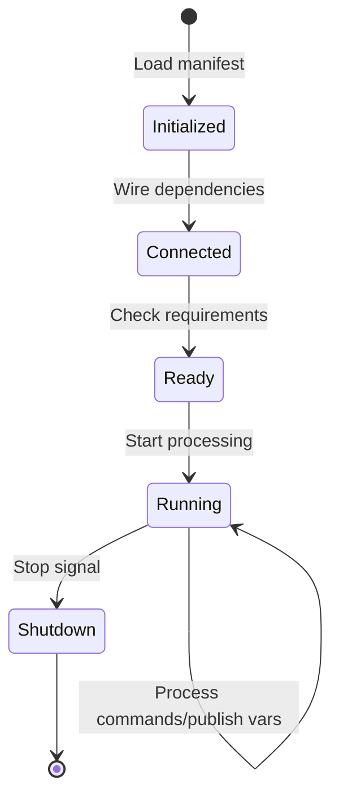

## What are Modules?

Modules are the fundamental building blocks of EVerest. Each module is an independent software component that:

- Implements one or more **interfaces** (provides functionality)
- Requires zero or more interfaces from other modules (consumes functionality)
- Has its own configuration parameters
- Runs as an independent process
- Communicates with other modules via MQTT

<Info>
  Think of modules as microservices - each one handles a specific responsibility and can be developed, tested, and deployed independently.
</Info>

## Module Structure

Every module has a consistent structure:

```bash
modules/CategoryName/ModuleName/
├── manifest.yaml          # Module metadata and interface definitions
├── CMakeLists.txt         # Build configuration
├── ModuleName.hpp         # Module header (C++)
├── ModuleName.cpp         # Module implementation
├── README.md              # Module documentation
└── [implementation dirs]  # Interface implementation code
```

### Module Manifest

The `manifest.yaml` file defines the module's capabilities. Example from `EvseManager`:

```yaml
description: >
  EVSE Manager. Grid side power meter: Will be used for energy management.
  Will also be used for billing if no car side power meter connected.
  
config:
  connector_id:
    description: Connector id of this evse manager
    type: integer
  charge_mode:
    description: Select charging mode
    type: string
    enum:
      - AC
      - DC
    default: AC
  evse_id:
    description: EVSE ID
    type: string
    default: DE*PNX*E1234567*1

provides:
  evse:
    interface: evse_manager
    description: This is the main evsemanager interface
  energy_grid:
    interface: energy
    description: This is the tree leaf interface for energy management

requires:
  bsp:
    interface: evse_board_support
  hlc:
    interface: ISO15118_charger
    required: false
  powermeter_grid_side:
    interface: powermeter
    required: false
```

<Note>
  The manifest defines what the module **provides** (interfaces it implements) and what it **requires** (dependencies on other modules).
</Note>

## Module Categories

Modules are organized into categories in the `modules/` directory:

### API

**Location**: `modules/API/`

Modules that provide external interfaces for integration with management systems and applications.

<Accordion title="Available API Modules">
  - **API** - Main API module providing REST/WebSocket interfaces
  - **RpcApi** - JSON-RPC API for external control
  - **EvAPI** - EV (vehicle) side API for testing
  - **auth_consumer_API** - Authentication consumer interface
  - **evse_manager_consumer_API** - EVSE manager consumer interface
</Accordion>

### EVSE

**Location**: `modules/EVSE/`

Core EVSE (Electric Vehicle Supply Equipment) logic modules.

<Accordion title="Available EVSE Modules">
  - **EvseManager** - Core charging session orchestration
  - **EvseSecurity** - Security and certificate management
  - **EvseSlac** - SLAC (Signal Level Attenuation Characterization)
  - **EvseV2G** - ISO15118 V2G communication
  - **Auth** - Authorization and authentication
  - **OCPP** / **OCPP201** - OCPP 1.6 and 2.0.1 implementations
</Accordion>

### HardwareDrivers

**Location**: `modules/HardwareDrivers/`

Low-level hardware abstraction modules.

#### Subcategories:

<AccordionGroup>
  <Accordion title="EVSE - Charge Controllers">
    Board support packages for various charge controller hardware:
    - YetiDriver - PIONIX Yeti hardware
    - MicroMegaDriver - Generic Arduino-based controllers
  </Accordion>
  
  <Accordion title="PowerMeters">
    Power meter drivers:
    - CarloGavazzi_EM580
    - LemDCBM400600
    - IsabellenhuetteIemDcr
  </Accordion>
  
  <Accordion title="PowerSupplies">
    DC and AC power supply drivers:
    - Huawei_V100R023C10 - Huawei DC power modules
    - InfyPower - InfyPower DC modules
    - Winline - Winline power supplies
  </Accordion>
  
  <Accordion title="NfcReaders">
    RFID/NFC reader drivers for authentication:
    - NxpNfcFrontendTokenProvider
  </Accordion>
  
  <Accordion title="Payment">
    Payment terminal integration modules
  </Accordion>
</AccordionGroup>

### EV

**Location**: `modules/EV/`

Electric vehicle simulation modules for testing.

<Accordion title="Available EV Modules">
  - **EvManager** - EV side manager for testing
  - **PyEvJosev** - Python-based ISO15118 EV simulator
</Accordion>

### EnergyManagement

**Location**: `modules/EnergyManagement/`

Energy management and distribution modules.

<Accordion title="Available Energy Modules">
  - **EnergyManager** - Central energy management coordinator
  - **EnergyNode** - Energy tree node for hierarchical power distribution
</Accordion>

### Simulation

**Location**: `modules/Simulation/`

Simulation modules for development and testing without physical hardware.

<Accordion title="Available Simulation Modules">
  - **YetiSimulator** - Simulates Yeti charge controller
  - **DCSupplySimulator** - DC power supply simulator
  - **SlacSimulator** - SLAC protocol simulator
  - **IMDSimulator** - Insulation monitoring device simulator
  - **OVMSimulator** - Over-voltage monitor simulator
</Accordion>

### Testing

**Location**: `modules/Testing/`

Utility modules for testing and bring-up.

### BringUp

**Location**: `modules/BringUp/`

Modules specifically designed for hardware bring-up and validation.

### Examples

**Location**: `modules/Examples/`

Example modules demonstrating module development.

## Module Lifecycle

Every module goes through a defined lifecycle managed by the EVerest runtime:



### 1. Initialization

- Runtime loads the module's `manifest.yaml`
- Module process is started
- Configuration parameters are loaded
- MQTT connection is established

### 2. Connection

- Runtime resolves module dependencies based on configuration
- Required interfaces are connected to providing modules
- Interface handlers are registered

### 3. Ready

- Module signals it's ready to operate
- All required dependencies are available
- Module can start publishing variables

### 4. Running

- Module actively processes:
  - Incoming commands via MQTT
  - Hardware events (for driver modules)
  - Timer callbacks
- Publishes state changes as variables
- Raises errors when needed

### 5. Shutdown

- Graceful cleanup of resources
- Close hardware connections
- Disconnect from MQTT
- Exit process

## Module Dependencies

Modules declare their dependencies through interface requirements in `manifest.yaml`:

```yaml
requires:
  bsp:
    interface: evse_board_support
    min_connections: 1
    max_connections: 1
  hlc:
    interface: ISO15118_charger
    required: false  # Optional dependency
  powermeter_grid_side:
    interface: powermeter
    required: false
```

### Required vs Optional

- **Required** (`required: true` or omitted): Module won't start without this dependency
- **Optional** (`required: false`): Module can function without it, with reduced functionality

### Connection Multiplicity

- `min_connections` / `max_connections`: Control how many modules can fulfill this requirement
- Useful for scenarios like multiple power meters or redundant sensors

## Module Communication

Modules communicate through three mechanisms:

### 1. Commands

Synchronous calls to other modules:

```cpp
// Calling a command on another module
auto result = r_bsp->call_enable(true);
```

### 2. Variables

Asynchronous publications of state:

```cpp
// Publishing a variable
p_evse->publish_session_event(session_event);
```

### 3. Errors

Error reporting across modules:

```cpp
// Raising an error
r_bsp.raise_error("evse_manager/VendingError", 
                  "Payment system unavailable");
```

<Tip>
  Learn more about these communication patterns in the [Messaging](/core-concepts/messaging) section.
</Tip>

## Developing Custom Modules

To create a new module:

1. **Choose a category** - Determine where your module fits
2. **Create directory structure** - Follow the standard layout
3. **Write manifest.yaml** - Define interfaces and configuration
4. **Implement interfaces** - Write the module logic
5. **Add to build system** - Update CMakeLists.txt
6. **Test** - Use simulation modules for testing

<Card title="Module Development Guide" icon="code" href="/development/creating-modules">
  Learn how to create custom modules with our comprehensive development guide
</Card>

## Module Configuration

Each module instance can be configured in the charging station's configuration file:

```yaml
active_modules:
  evse_manager:
    module: EvseManager  # Module type
    config_module:        # Configuration parameters
      connector_id: 1
      charge_mode: DC
      evse_id: DE*PNX*E12345*1
    connections:          # Dependency wiring
      bsp:
        - module_id: yeti_driver
          implementation_id: board_support
      hlc:
        - module_id: iso15118_charger
          implementation_id: charger
```

<Note>
  See the [Configuration](/core-concepts/configuration) page for complete configuration examples.
</Note>

## Next Steps

<CardGroup cols={2}>
  <Card title="Interfaces" href="/core-concepts/interfaces" icon="plug">
    Learn about module interfaces and how they're defined
  </Card>
  <Card title="Configuration" href="/core-concepts/configuration" icon="sliders">
    Configure modules for your charging station
  </Card>
  <Card title="Messaging" href="/core-concepts/messaging" icon="message">
    Understand inter-module communication
  </Card>
  <Card title="Architecture" href="/core-concepts/architecture" icon="diagram-project">
    See how modules fit into the overall architecture
  </Card>
</CardGroup>
